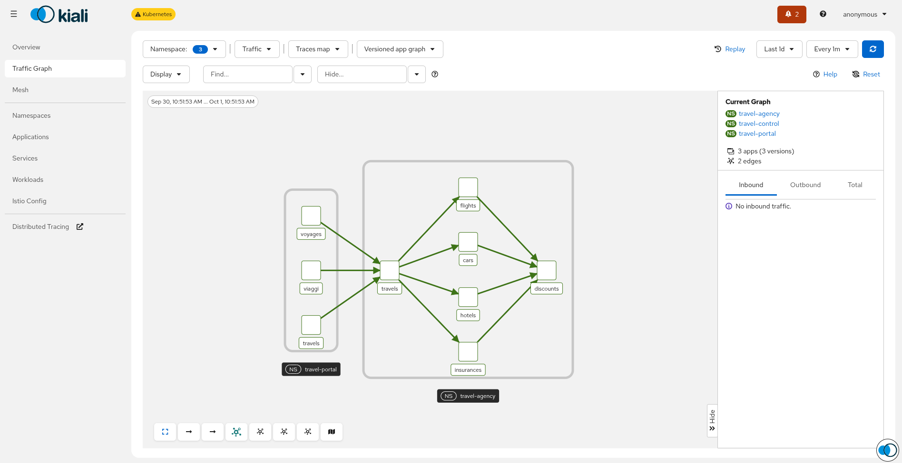

# Tracing Traffic Map KEP

1. [Summary](#summary)
2. [Motivation](#motivation)
   1. [Goals](#goals)
   2. [Non-Goals](#non-goals)
3. [Solution](#solution)
4. [Limitations](#limitations)
   1. [Jaeger vs Tempo](#jaeger-vs-tempo)
   2. [How services are selected](#how-services-are-selected)
   3. [Trace and query API limits](#trace-and-query-api-limits)
   4. [Graph semantics vs metrics map](#graph-semantics-vs-metrics-map)
5. [Roadmap](#roadmap)

# Summary

Add an experimental **Traces map** (`telemetryVendor=tracing`) that builds the Traffic Graph from distributed traces (Jaeger / Tempo) instead of Prometheus metrics. Users can switch between **Metrics map** (Istio / Prometheus, default) and **Traces map** when tracing is enabled.

This is a new telemetry vendor, not an appender: appenders enrich a metrics-built graph; the tracing vendor replaces the telemetry source.

# Motivation

Metrics graphs show request rates and topologies derived from Istio telemetry in Prometheus. Traces carry a different signal: sampled request paths, service identity from spans, and parent→child call relationships. A traces-based map helps users:

- Compare mesh topology as seen by tracing vs metrics
- Validate that instrumentation and service naming produce useful call graphs
- Explore paths that exist in traces even when metrics are sparse or misconfigured

## Goals

- Selectable telemetry vendor on the Traffic Graph (Istio metrics vs tracing)
- Build a `TrafficMap` by aggregating parent→child span edges across fetched traces
- Reuse existing graph config / UI where practical (graph type, namespaces, duration)
- Keep fetch cost bounded (per-app trace limit, max apps per namespace)

## Non-goals

- Replace the metrics graph as the default or production-grade traffic view
- Reproduce Prometheus rates, percentiles, throughput, or security/mTLS appenders from traces
- Full multi-cluster tracing topology
- Guarantee completeness under sampling (the map is inherently approximate)

# Solution

## Backend

- New package `graph/telemetry/tracing`
- `BuildNamespacesTrafficMap` lists apps in requested namespaces, fetches traces per app via `Tracing.GetAppTraces`, deduplicates by trace ID, then aggregates edges with `BuildTrafficMapFromTraces`
- Edges store absolute call counts (`traceCallCount`) and a capped list of contributing trace IDs; HTTP-like metadata is filled so existing graph marshaling works
- Node graphs reuse the namespace build and filter to the requested node’s neighborhood
- Graph API switches on `telemetryVendor` (`istio` | `tracing`)

## Frontend

- Toolbar dropdown: **Metrics map** / **Traces map** (Traces only if tracing is enabled)
- `telemetryVendor` in Redux + URL (`telemetryVendor=tracing`)
- Passed through graph fetch params; metric-oriented appenders are not requested for the tracing vendor

## Identity extraction

Span process / service name is parsed as `app.namespace` (Istio-style), with optional tags (`istio.canonical_service`, `istio.namespace`, `service.namespace`, `peer.service`). Same-service client/server pairs do not create edges.

# Limitations

## Jaeger vs Tempo

| Aspect | Jaeger | Tempo |
|--------|--------|--------|
| Search API | `/api/traces` — typically returns **full traces** with complete span trees | `/api/search` (TraceQL) — returns **span sets** (partial matches), not full traces |
| Spans returned | All spans in matching traces (subject to Jaeger limits) | Capped by `spss` / `SpansPerSpanSet` (Kiali sets **10**) |
| Service catalog | `GetServices` lists registered services | HTTP: `/status/services`; gRPC “services” from search metadata (`RootTraceName`) — **not** a reliable mesh service inventory |
| Detail by ID | Full trace fetch supported | Full trace via `/api/traces/{id}`; search path used for the map does **not** hydrate full traces |

**Practical impact:** Tempo-based maps see fewer spans per trace and weaker parent→child coverage than Jaeger. Missing parents mean missing edges. Tempo is more sensitive to TraceQL `select` attributes and `spss`.

## How services are selected

The tracing graph does **not** drive discovery from the tracing backend’s service list.

1. Apps come from Kiali’s **Kubernetes app list** (`App.GetAppList`) for each selected namespace
2. Caps: **50 apps per namespace**, **20 traces per app** (defaults)
3. Each app is queried with `GetAppTraces`, using Kiali’s tracing service name rules (`app` or `app|namespace` when `NamespaceSelector` is enabled)

Implications:

- Apps with no K8s workload identity are never queried, even if traces mention them
- Trace backends may use different service names than Kiali builds → empty results
- Cross-namespace callers/callees can appear as nodes from span data, but **queries are only issued for apps in selected namespaces**

## Trace and query API limits

- **Sampling:** Only sampled traffic appears; low-traffic or unsampled edges are missing
- **Time window + limit:** Recent / limited traces only — not a census of all traffic in the duration
- **Tempo search incompleteness:** Span sets + `spss=10` truncate large traces; graph edges may omit hops
- **No N+1 full-trace hydrate in the POC:** Search results are converted as-is (unlike a design that would `GetTrace` every ID)
- **Query cost:** One search per app (× namespaces); large namespaces hit the app/trace caps quickly
- **Timeouts / errors:** Failed app queries are skipped; the map can be silently partial
- **Tag / naming dependency:** Bad or inconsistent `service.name` / Istio tags produce wrong or duplicate nodes

## Graph semantics vs metrics map

- Edge values are **absolute call counts** from sampled spans, not request rates (rps)
- Status codes are stubbed for marshaling (not real HTTP response distributions from traces)
- Metric appenders (health, idle nodes, security policy, response time, throughput, etc.) **do not apply**
- Workload / version graphs often fall back to **app-named workloads** when workload tags are absent
- Multicluster: uses the local / configured cluster name; remote-cluster span topology is not first-class

# Roadmap

- [x] POC: tracing telemetry vendor + UI toggle
- [ ] Document user-facing expectations (experimental, sampling, Tempo vs Jaeger)
- [ ] Evaluate Tempo: raise `spss`, selective full-trace fetch, or TraceQL tuned for topology
- [ ] Optional: discover/query by tracing service catalog (especially Tempo) instead of only K8s apps
- [ ] Richer identity (workload, version, cluster) from span tags
- [ ] Decide productization vs keep experimental / behind flag
